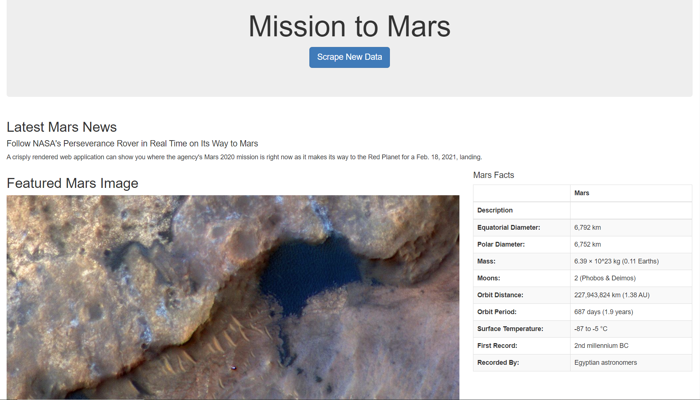
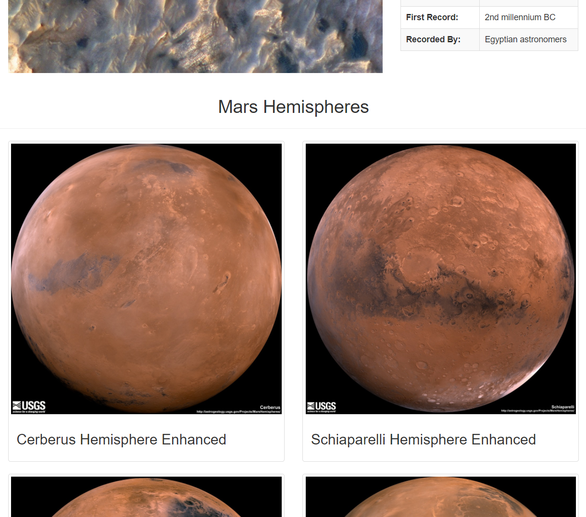
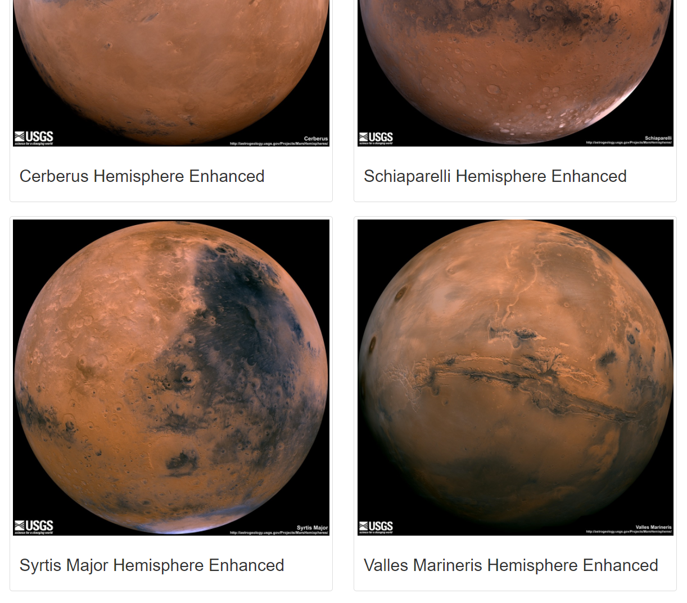

# Web Scraping Challenge - Mission to Mars

In this assignment, I've built a web application that scrapes various websites for data related to the Mission to Mars and displayed the information in a single HTML page.

- - -

## Step 1 - Scraping

Complete the following scrapes using Jupyter Notebook, BeautifulSoup, Pandas, and Splinter.

### NASA Mars News

* Scrape the [NASA Mars News Site](https://mars.nasa.gov/news/) and collect the latest News Title and Paragraph Text.

### JPL Mars Space Images - Featured Image

* Visit the url for JPL Featured Space Image [here](https://www.jpl.nasa.gov/spaceimages/?search=&category=Mars).

* Use splinter to navigate the site and find the image url for the current Featured Mars Image and assign the url string to a variable called `featured_image_url`.

### Mars Facts

* Visit the Mars Facts webpage [here](https://space-facts.com/mars/) and use Pandas to scrape the table containing facts about the planet including Diameter, Mass, etc.

### Mars Hemispheres

* Visit the USGS Astrogeology site [here](https://astrogeology.usgs.gov/search/results?q=hemisphere+enhanced&k1=target&v1=Mars)

* Use splinter to navigate the site to obtain high resolution images for each of Mar's hemispheres.

- - -

## Step 2 - MongoDB and Flask Application

* Use MongoDB with Flask templating to create a new HTML page that displays all of the information that was scraped from the URLs above

* Use Pymongo for CRUD applications for the database.

* Use Bootstrap to structure the HTML template.

- - -

## Step 3 - Where to find the files

1. [The Jupyter Notebook containing the scraping code used](Missions_to_Mars/mission_to_mars.ipynb).

2. [Screenshots of the final application](Missions_to_Mars/screenshots).

3. [Flask app](Missions_to_Mars/app.py).

4. [Jinja template](Missions_to_Mars/templates/index.html).

### Copyright of the challenge

Trilogy Education Services © 2020. All Rights Reserved.